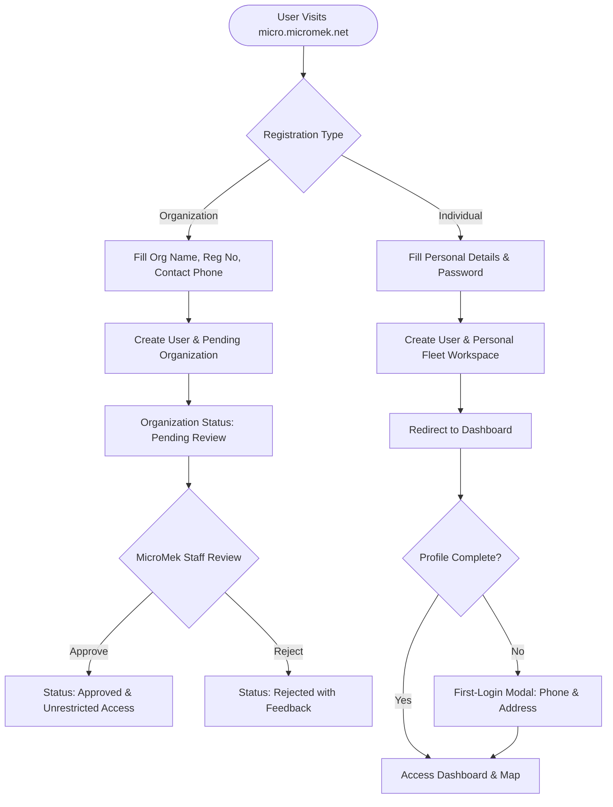
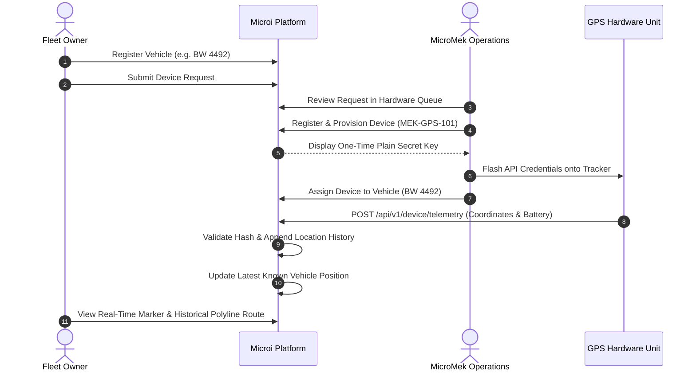
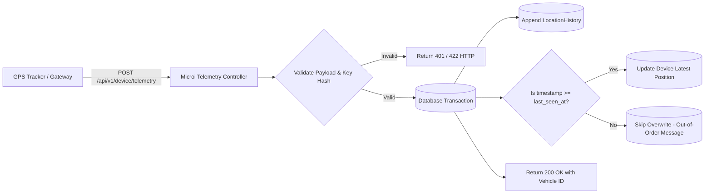

# Microi Workflows & Lifecycles

## 1. Individual & Organization Registration

```mermaid
flowchart TD
    Start([User Visits micro.micromek.net]) --> Choice{Registration Type}
    Choice -->|Individual| IndivReg[Fill Personal Details & Password]
    Choice -->|Organization| OrgReg[Fill Org Name, Reg No, Contact Phone]
    IndivReg --> IndivCreate[Create User & Personal Fleet Workspace]
    OrgReg --> OrgCreate[Create User & Pending Organization]
    IndivCreate --> LoginRedirect[Redirect to Dashboard]
    OrgCreate --> PendingWait[Organization Status: Pending Review]
    PendingWait --> MicroMekReview{MicroMek Staff Review}
    MicroMekReview -->|Approve| OrgActive[Status: Approved & Unrestricted Access]
    MicroMekReview -->|Reject| OrgRejected[Status: Rejected with Feedback]
    LoginRedirect --> OnboardingCheck{Profile Complete?}
    OnboardingCheck -->|No| Modal[First-Login Modal: Phone & Address]
    OnboardingCheck -->|Yes| MainDash[Access Dashboard & Map]
    Modal --> MainDash
```

## 2. GPS Hardware Request & Provisioning Lifecycle

```mermaid
sequenceDiagram
    autonumber
    actor Customer as Fleet Owner
    participant App as Microi Platform
    actor Staff as MicroMek Operations
    participant Device as GPS Hardware Unit

    Customer->>App: Register Vehicle (e.g. BW 4492)
    Customer->>App: Submit Device Request
    Staff->>App: Review Request in Hardware Queue
    Staff->>App: Register & Provision Device (MEK-GPS-101)
    App-->>Staff: Display One-Time Plain Secret Key
    Staff->>Device: Flash API Credentials onto Tracker
    Staff->>App: Assign Device to Vehicle (BW 4492)
    Device->>App: POST /api/v1/device/telemetry (Coordinates & Battery)
    App->>App: Validate Hash & Append Location History
    App->>App: Update Latest Known Vehicle Position
    Customer->>App: View Real-Time Marker & Historical Polyline Route
```

## 3. Telemetry Ingestion Sequence

```mermaid
flowchart LR
    Unit[GPS Tracker / Gateway] -->|POST /api/v1/device/telemetry| API[Microi Telemetry Controller]
    API --> Val{Validate Payload & Key Hash}
    Val -->|Invalid| Err[Return 401 / 422 HTTP]
    Val -->|Valid| DBTx[(Database Transaction)]
    DBTx --> Hist[(Append LocationHistory)]
    DBTx --> LastCheck{Is timestamp >= last_seen_at?}
    LastCheck -->|Yes| UpDev[(Update Device Latest Position)]
    LastCheck -->|No| SkipDev[(Skip Overwrite - Out-of-Order Message)]
    DBTx --> Resp[Return 200 OK with Vehicle ID]
```
